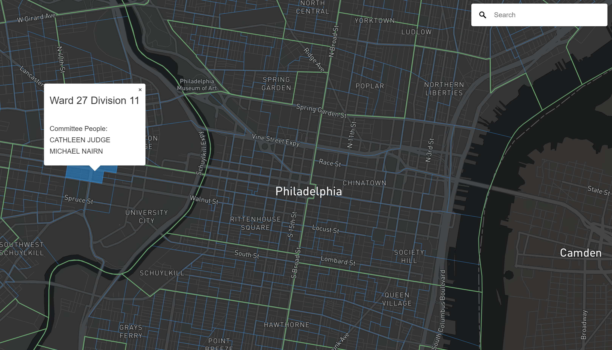
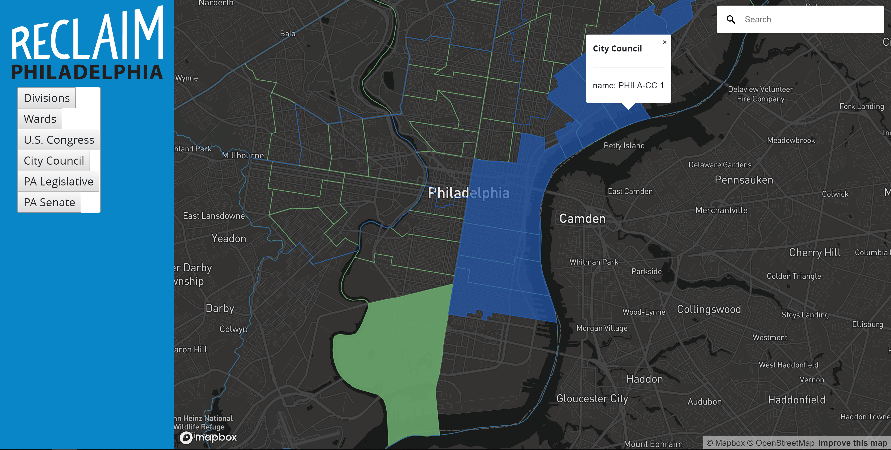
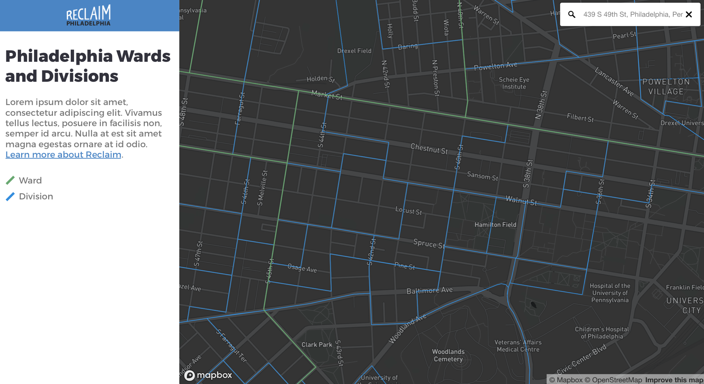

# Reclaim Map

*Organizer and activist map developed by Reclaim Philadelphia*

## Summary
The Reclaim Map project intends to help citizens of Philadelphia build
grassroots political power by making it easy to understand their local
political environment. Our goal is to make an extremely intuitive web app
that makes it easy for users to see where political boundaries lie, who
represents them, and how to engage with local leaders. We think that people will
feel more empowered to engage in electoral campaigns and direct action when they
can see who represents them and their community at the local level.

## Existing Features  
The live prototype provides a simple interface showing the wards and divisions in Philadelphia. Within the UI, a search bar is provided in the top-right corner that let's users geolocate and zoom to addresses. Clicking on the map highlights the division boundary and presents a pop-up with presenting the ward and division number as well as the division committeepeople.   

Map state is preserved by updating the URL parameters each time the map is adjusted or clicked. This allows users to share their map with others.  The prototype map is hosted [here](https://reclaimphiladelphia.github.io/reclaim_map/).

## Recent Development Updates
The latest progress on this branch (sidebar) includes a basic sidebar functionality
(without using the atlas.phila.gov framework). This is daylighting a lot of the
existing progress made to-date in the prototype. Now we can toggle layers off/on
and control what is included via a [config file](docs/static/js/config.js).

## Next Steps
Version 1.0 will build upon the existing functionality and provide users with more data and interactivity. Reclaim Map will most reconfigured to use Vue.js, starting with the app structure developed for the atlas.phila.gov project.

#### UI Improvements
A major addition to the UI will be a left-side navigation pane to provide more information and functionality to the rest of the app. There, users will be able to toggle different data layers and access more detailed information about campaigns, political leaders, upcoming elections.

## Getting Involved
We would love to have you help out! Get involved by checking out the issues and [Project](https://github.com/reclaimphiladelphia/reclaim_map/projects/1)
