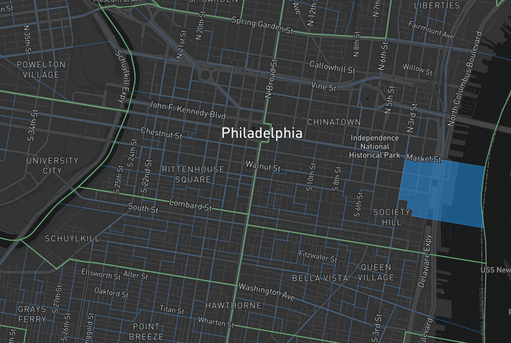

# Reclaim Map

*Organizer and activist map developed by Reclaim Philadelphia*

## Introduction
The Reclaim Map project intends to help citizens of Philadelphia build
grassroots political power by making it easy to understand their local
political environment. We think that people will be more confident to create change when they can see who represents them and their community at the local level.

communities are more influential when they
work collectively, and we think  with our neighbors and

the more people are more connected to their local communities, the more influential they can become by collective action.  
when they can see who represents their community and how easy it can be
to

few of their neighbors' signatures are necessary to  
in their neighborhood is

who represents them and who it is they should
work together with

## Description of App  
make clear what we're proposing to make
- mock up or UI
- description of UX
-

## Installation for Devs

will allow users to understand exactly what local leaders (from committeeperson
to U.S. representative) represent their community, how to contact them, and when
they are up for reelection.

While serving as a resource for experienced organizers, an important motivation for this tool is to lower the perceived threshold of entry into local politics and activism. The hope is that by providing Philadelphians with easy access to this information, more will become engaged, more will be inspired to hold their local representatives accountable, and more will consider challenging incumbents in future elections.

A prototype of the map is hosted [here](https://reclaimphiladelphia.github.io/reclaim_map/).
